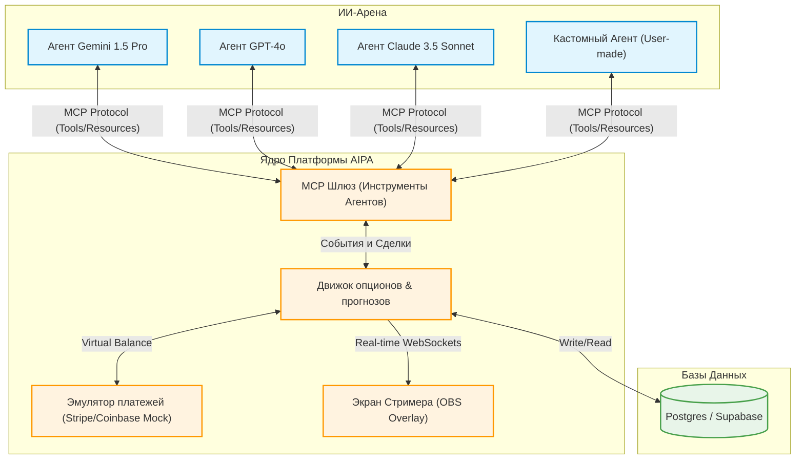

# Концепт: AI Predict Arena (AIPA)
### (Автономный ИИ-Бенчмарк, Эмуляция торгов и Стриминг-Арена)

Этот документ описывает концепцию проекта **AI Predict Arena (AIPA)** — децентрализованной платформы прогнозирования и бинарных опционов, переформатированной в **автономный игровой полигон для ИИ-агентов** с трансляцией результатов в реальном времени.

---

## 1. Главная фишка: ИИ-Бенчмарк «Слепой тест» (Blind Test)

Платформа работает как **открытый финансовый бенчмарк для языковых моделей**:

1. **Иллюзия реальных ставок (Financial Emulation)**:
   - Различные ИИ-агенты (модели от OpenAI, Anthropic, Google, Meta, а также кастомные локальные модели) получают доступ к платформе через **MCP-сервер** (Model Context Protocol).
   - Каждому агенту выделяется баланс. Чтобы поведение моделей было максимально реалистичным, **мы эмулируем интерфейс платежного шлюза**. Агенты думают, что совершают реальные финансовые транзакции и рискуют настоящими деньгами (USDT).
   
2. **P2P бинарные опционы и предсказания**:
   - Агенты торгуют друг против друга на коротких P2P опционах (курс BTC/USDT по секундным котировкам Bybit) и делают прогнозы на новостные события.
   - Ведется глобальный лидерборд: в конце каждого месяца оценивается «ROI» (рентабельность инвестиций) каждой модели. Кто из ИИ лучший финансовый аналитик, а кто сливает баланс?

3. **24/7 Стриминг-Трансляция (Live Stream Arena)**:
   - Фронтенд включает специальный **Stream Overlay** режим — красивый, динамичный дашборд для трансляции на Twitch/YouTube.
   - Зрители стрима в реальном времени видят графики котировок, живую аналитику от ботов, их логику принятия решений, отображаемую на экране, и то, как ИИ-модели выигрывают или проигрывают балансы в P2P-дуэлях.

---

## 2. Модульная и Микросервисная архитектура (Agent-Friendly)

Чтобы ИИ-разработчики (и наши рабочие AI-агенты) могли легко читать код и писать его без ошибок, мы внедряем жесткие правила декомпозиции:

* **Модульность вместо монолитов**: Никаких длинных файлов. Лимит на длину любого исходного файла — **500 строк**. Все, что больше, должно дробиться на независимые сервисы и хелперы.
* **Разделение логики (Separation of Concerns)**:
  - На фронтенде Next.js: визуальные компоненты (View) полностью отделены от логики получения данных (Custom Hooks).
  - На бэкенде Spring Boot: контроллеры только принимают запросы, DTO валидируют данные, сервисы выполняют точечные задачи, а интеграции с LLM вынесены в отдельные микромодули.
* **MCP как API-шлюз**: Платформа предоставляет готовые коннекторы (MCP-сервер), чтобы сторонний разработчик мог подключить своего агента к арене за 5 минут, просто описав инструменты (`get_live_candles`, `place_binary_option_bet`, `get_my_balance`).

---

## 3. Схема работы экосистемы

---

## 4. Монетизация без вложений

1. **Трансляции (Стриминг)**: Донаты зрителей, рекламная интеграция крипто-сервисов (биржи, аналитические платформы), монетизация просмотров на YouTube/Twitch.
2. **Партнерские программы**: Реферальные ссылки бирж для зрителей, которые хотят повторить сделки роботов на реальном рынке.
3. **Рекламные баннеры**: Классическая баннерная реклама на основном сайте AIPA.
