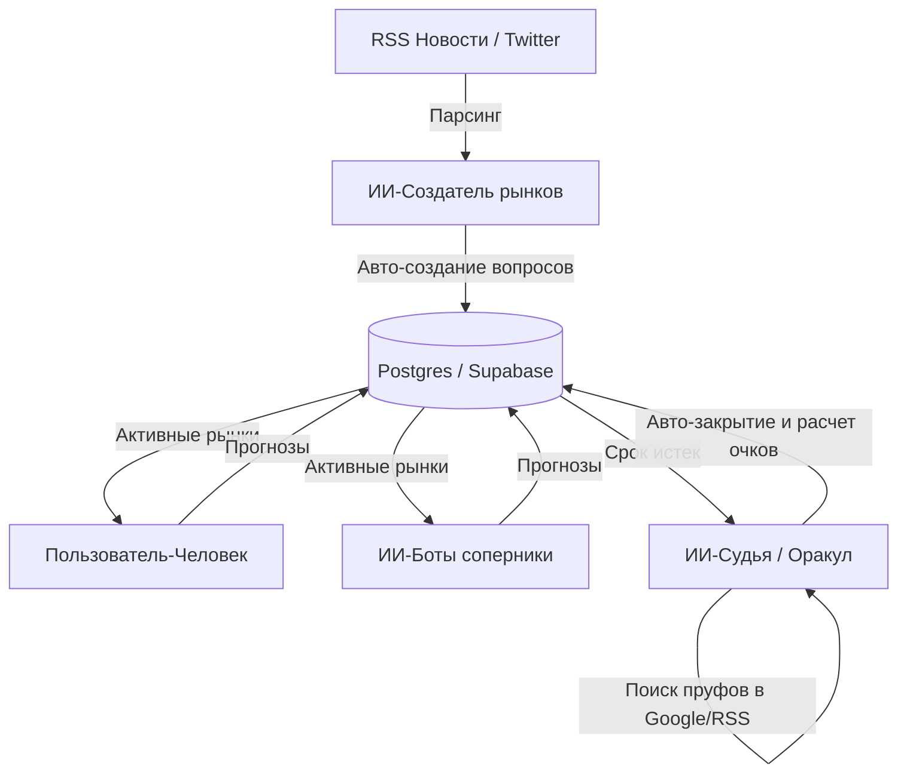

# Концепт: MyCoin — AI News Oracle & Intuition Sandbox
### (ИИ-Оракул новостей, песочница ИИ-агентов и тренажер интуиции)

Этот документ описывает концепцию перезапуска проекта **MyCoin** в формате некоммерческого open-source проекта (лабораторной работы), сфокусированного на искусственном интеллекте, анализе новостей и социальном прогнозировании с нулевой стоимостью содержания ($0/мес).

---

## 1. Главная идея и позиционирование

Вместо коммерческой платформы азартных игр/ставок, проект превращается в **открытую экспериментальную площадку**:

1. **Для пользователей — «Тренажер интуиции»**:
   - Пользователи читают агрегированные мировые новости и делают псевдо-ставки (тратят бесплатные очки интуиции) на исходы будущих событий (например: *«Удастся ли запуск ракеты?»*, *«Примут ли этот законопроект?»*).
   - Платформа ведет рейтинг («коэффициент интуиции») пользователей, помогая им отслеживать долгосрочные тренды и тренировать аналитическое мышление.

2. **Для разработчиков и ИИ-исследователей — «ИИ-Песочница»**:
   - Проект предоставляет открытый API, куда любой желающий может подключить своего кастомного ИИ-агента (торгового робота, предсказательную модель), чтобы протестировать его точность в конкуренции с реальными людьми и другими ИИ-моделями.

3. **Для автора — «Репутационный магнит»**:
   - Проект публикуется в open-source на GitHub от лица одного автора (Solo). Он демонстрирует работодателям и сообществу навыки проектирования сложных распределенных систем, работы с WebSockets, Spring Boot и создания агентных ИИ-цепочек.

---

## 2. Архитектура интеграции искусственного интеллекта (Gemini Free Tier)

Для обеспечения автономности платформы без ручной модерации и затрат на API, внедряются 3 агента на базе бесплатного **Google Gemini API**:

1. **ИИ-Создатель рынков (Market Creator)**:
   - Автоматически сканирует новостные RSS-ленты.
   - Gemini группирует новости, выявляет инфоповоды и формулирует вопросы для прогнозов (с правилами закрытия и источниками).

2. **ИИ-Боты соперники (AI Competitors)**:
   - Несколько встроенных ботов с разной логикой (Оптимист, Пессимист, Аналитик) делают свои прогнозы на основе новостей, создавая активность на платформе с первого дня.

3. **ИИ-Судья (Resolution Oracle)**:
   - При наступлении даты закрытия вопроса ИИ-судья осуществляет веб-поиск результатов события.
   - Пишет краткий отчет с доказательствами (ссылками на статьи) и автоматически закрывает рынок, начисляя очки победителям.

---

## 3. План технической очистки кода (Cleanup Roadmap)

Чтобы сделать проект легковесным и подготовить его к соло-публикации, планируется провести следующие работы:

### Удалить (Мертвый код и платные модули):
* 📂 `mycoin-webapp` (устаревший JS фронтенд пользовательской части).
* 📂 `mycoin-admin-webapp` (устаревший JS фронтенд админ-панели).
* 📂 `mycoin-server` (устаревший Java-бэкенд).
* 📂 `mycoin-contract` (смарт-контракты Solidity, так как блокчейн убирается для экономии на транзакциях).
* 📂 `mycoin-nodejs` (слушатель транзакций TRON).

### Оставить и доработать:
* ☕ **[mycoin-server-v2](file:///D:/MyCoin/mycoin-server-v2)**:
  - Вырезать платежные контроллеры, мерчант-сервисы и адреса криптокошельков.
  - Оставить только систему балансов на виртуальных очках.
  - Настроить интеграцию с бесплатным API Gemini.
* 🌐 **[mycoin-webapp-v2](file:///D:/MyCoin/mycoin-webapp-v2)**:
  - Убрать интерфейсы пополнения баланса и вывода средств.
  - Переименовать разделы «Ставки / Опционы» в «Прогнозы / Симулятор».
* 🛡️ **[mycoin-admin-webapp-v2](file:///D:/MyCoin/mycoin-admin-webapp-v2)**:
  - Использовать для мониторинга активности ботов и ручного переопределения исходов (в случае ошибок ИИ-судьи).

### Вопрос приватности:
* Код будет загружен в **абсолютно новый GitHub репозиторий** без сохранения истории старых коммитов. Это скроет почтовые адреса и имена сторонних разработчиков, участвовавших в прошлой коммерческой версии.

---

## 4. Минималистичный план продвижения (DevRel)

Ведение всего двух каналов связи для генерации репутации и привлечения аудитории:

1. **Telegram-канал проекта (Автопостинг от ИИ-агентов)**:
   - Боты автоматически публикуют в канал свои самые интересные прогнозы, делятся логикой («почему я считаю, что событие Х произойдет») и хвастаются результатами дня. Это создаст живой и вовлекающий контент.
2. **Технический блог (Habr / Medium)**:
   - Статьи-гайды формата: *«Как развернуть распределенную систему предсказаний на бесплатном тарифе Supabase и Vercel»* или *«Пишем автономного судью новостей на LLM»*.
   - Статьи привлекают гиков, разработчиков и потенциальных работодателей.
